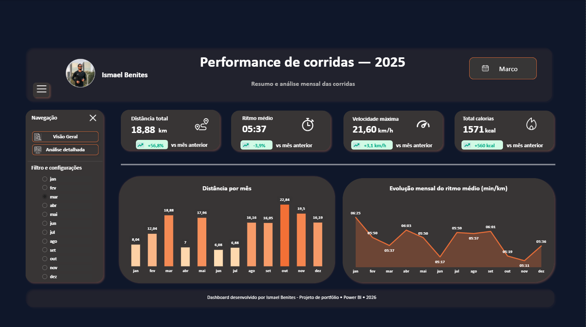
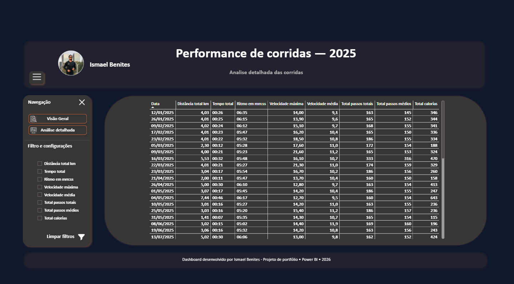

# 📊 Dashboard de Performance de Corridas — Power BI

## 📌 Sobre o Projeto
Este projeto foi desenvolvido com o objetivo de analisar o desempenho em corridas utilizando dados do aplicativo Adidas Running.

A proposta é transformar dados brutos em insights visuais que permitam acompanhar evolução, consistência e performance ao longo do tempo.

---

## 🎯 Objetivo
- Monitorar evolução de desempenho
- Identificar padrões nos treinos
- Comparar métricas ao longo do tempo

---

## 🛠️ Ferramentas utilizadas
- Power BI
- DAX
- Excel

---

## 📊 Dashboard

Abaixo estão algumas visualizações do dashboard desenvolvido:

---

## 🔍 Principais análises
- Evolução de performance ao longo do tempo
- Consistência nos treinos
- Comparação entre períodos

---

## 🚀 Insights gerados
- Identificação de padrões de melhoria no ritmo
- Análise de frequência de treinos
- Tendências de performance

---

## 📁 Estrutura do projeto
- `Running stats.xlsx` → base de dados
- `Dash running.pbix` → dashboard Power BI
- `images/` → imagens do dashboard
